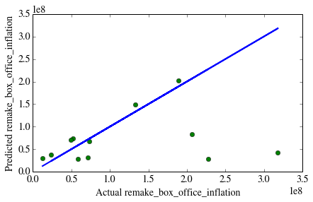

##Movie Data Check-in 

I used a linear regression model with one feature to describe the Total Box Office Gross of a movie remake as a function of the Total Box Office Gross of the Original Movie. 

Only movie remakes that were released within 10 years of the original movie are included in this analysis.

The figure depicts the model (blue) plotted against the actual datapoints (green).

The model's current performance suggests that it can predict the total gross of a movie remake +/- $200m with 95% accuracy.
